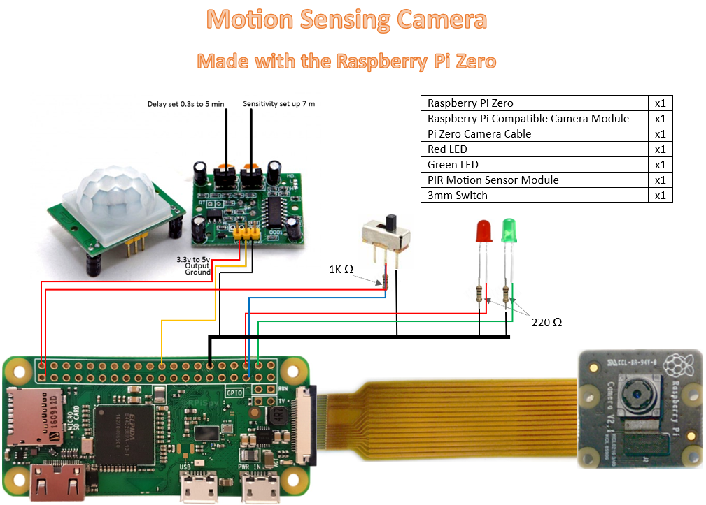

# Motion Activated Camera

This project was inspired by a neighborhood cat that would come into our house through our pet door and make himself at home. We weren't sure when he would come in. We'd always just find him there. I built this motion-sensing camera and set it up next to my pet door so I could find out when the little guy was getting into the house.

## Setting up the Program:

### Diagram



- Note: For connecting directly to the camera, you will need some [additional materials.](#option-1-direct-cable-link)

### Walkthrough:

1. Set up the Raspberry Pi Zero. [INSTRUCTIONS HERE](https://github.com/DavidMiles1925/pi_zero_setup). **Ensure you set up a Static IP Address.**

2. Wire up the Pi: See [diagram](#diagram) above.

3. Install Code:

```bash
git clone https://DavidMiles1925/motion_camera.git
```

4. Edit config.py to configure the program. See the [instructions for modifying config.py](#configpy)

5. Set up the program to run on starup. [INSTRUCTIONS HERE](https://github.com/DavidMiles1925/pi_zero_setup#configure-a-program-to-run-on-startup)


## Using the program:

### Configuring the program
>
> **Be sure to [`CONFIGURE`](#configpy) the program before running.**
> - See the configuration [technical notes](#configpy) for more information.
> - The `SAVE_DIRECTORY_PATH` and `LOG_DIRECTORY_PATH paths` will need to be set for the program to run correctly.
> - If you are recording in an area with people present, ensure the `LED_INDICATORS` value in the config file is set to `True`.
> - Set the value of `RESTART_ON_EXCEPTION` to `False` while testing the machine to avoid a loop you can't get out of.
>

### Turning on the Camera:
> 
> The program will automatically start on boot. (If you followed step 5 in the [Walkthrough](#walkthrough)) This takes ~2 minutes.
> 
> To turn on the motion camera, simply power on the device and toggle the switch to the ON position.
>

### Accessing the Machine
>
> Access to the file system can be achieved in one of two ways:
> 
> #### Option 1: Direct Cable Link
> 
> You will need some additional materials:
> - Mini HDMI Cable or adapter
> - Micro USB Cable or adapter
> - Monitor
> - Keyboard
> 
> Connect everything to your Pi (Power port is the farthest from HDMI on the Pi Zero).
> 
> Once powered up, proceed to [Copying Videos] or [Accessing Logs]
> 
> #### Option 2: SSH Connection
>
>**Note: Running the program directly through the SSH shell will cause the program to close when the SSH connection is severed. To restart the program once it has stopped, it is recommended that you reboot the machine in order to restart the program.**
> 
> Ensure you have set up a [static IP address](https://github.com/DavidMiles1925/pi_zero_setup#configure-static-ip-address). Once you have done so, open a terminal window from another machine and access the motion camera Pi.
> 
> ```bash
> ssh username@192.168.1.1
> ```
> 

### Copying Videos

>
>**It is a good idea to [stop the program](#stop_programpy) before copying videos.**
>
>Format: scp -r [source] [destination]
>
>Example from source machine:
>
>```bash
>scp -r /home/usename/motion_camera_recordings/vids01.01.2050/ user@:/home/copy/here
>```
>

### Stopping the program:
>
>Run the [stop_program.py](#stop_programpy) script **using `sudo`**
>

## Technical Notes:

### Viewing the Logs

```bash
sudo nano /motion_camera/logs/Fri01-log.txt
```

### config.py:

**Comments have been left in the code for easy reviewing when coming back to this project after a long time.**

>
>**`FILENAME_PREFIX`**
>
>>This prefix will be added to the beginning of each file  
>>- **NOTE:** that without a prefix, the filename will begin with a '-'.
>>
>> Example:  
>>`{FILENAME_PREFIX}-000000-[hh.mm]`
>
>---
>
>**`DIRECTORY_NAME_PREFIX`**
>
>>This is the name of the directiory where the video files will be stored.
>>
>> Example:  
>>`{DIRECTORY_NAME_PREFIX}MM.DD.YYYY`
>
>---
>
>**`SAVE_DIRECTORY_PATH`**
>
>> This sets the path to where the videos will be saved.
>>- Example: "/home/meowth/motion_camera/recordings"  
>>- **NOTE:** that any subdirectories inside of the project folder (such as 'recordings' above) MUST be created before running the program. The program will automatically create a directory for the videos recorded during a particular day, however that is the ONLY directory it will create.
>
>---
>
> **`CONSOLE_OUTPUT_ON`**
> 
>> Boolean value that determines whether output will be logged to the console.
>
>---
>
> **`LOGGING_ENABLED`**
>
>> Boolean value that determines whether output will be logged to the log file.
>
>---
>
>**`LOG_DIRECTORY_PATH`**
>
>> This sets the path to where the logs will be saved.
>>- example: "/home/meowth/motion_camera/logs"  
>>- **NOTE:** that any subdirectories inside of the project folder (such as 'logs' above) MUST be created before running the program. The program will automatically create a directory for the videos recorded during a particular day, however that is the ONLY directory it will create.
>
>---
>
>**`REBOOT_ON_EXCEPTION`**
>
>> When set to True, the system will automatically reboot after 60 seconds. This is useful if for some reason an error occurs with the camera and stops the program. This way, the camera will attept to keep iteself running when unattended for long periods.
>
>---
>**`LED_INDICATORS`**
>
> **NOTE: This camera is not intended to be used for survelliance purposes. LED indicators should always be ACTIVE AND VISIBLE in places where there is A REASONABLE EXPECTATION OF PRIVACY. Check your local laws to ensure you are not breaking them.**
>
>This turns the LED indicators on or off.
>
>`True`: The LED indicators will function normally. This is useful for testing when away from a monitor/keyboard. Also, when recording people, this lets others know that the device is on and/or recording.
>
>`False`: The LED indicators will be disabled. This is useful for recording animals, or other situations where you would not want to it to be immediately obvious that the camera is doing anything.
>

### stop_program.py

This script was created to stop the program while accessing the device via SSH. The main program was not directly accessible through the CLI because it was running in the background. This allowed the process of stopping the program to be logged, creating a timestamp to determine how long the camera was off.

```bash
sudo python stop_program.py
```
**NOTE: You MUST use `sudo` when running this script**

After you have finished, be sure to reboot the system so that the program starts again.

```bash
sudo reboot
```

### preview.py

This file was used during testing. It starts the camera with a preview window in order to verify the camera is working, and to test the camera under various conditions.

### logger.py

Used to log stopping and starting events in the program for reference after being remotely deployed.